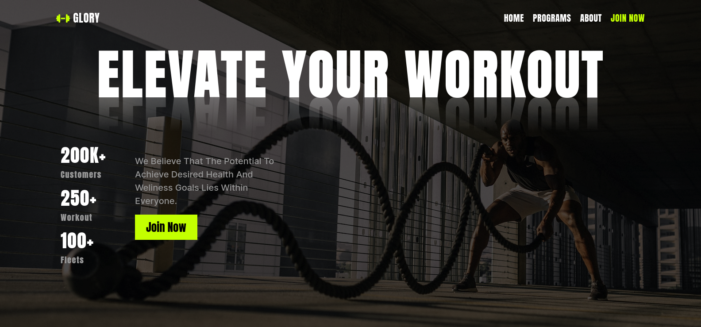

# Fitness site [GLORY] 

Transforme  design to a responsive webpage with HTML and CSS.

## Table of contents

- [Overview](#overview)
  - [The challenge](#the-challenge)
  - [Links](#links)
- [My process](#my-process)
  - [Built with](#built-with)
  - [Learning](#learning)
- [Author](#author)

## Overview

### The challenge

Users should be able to:

- View the optimal layout for the section depending on their device's screen size

### Links

- Solution URL: [Solution URL here](https://github.com/cd-wb/fitness-golry)
- Live Site URL: [Live site URL here](https://cd-wb.github.io/fitness-golry)

## My process

### Built with

- Semantic HTML5 markup
- CSS custom properties
- Flexbox
- CSS Grid

### Learning

- background image
- Practex in flexbox and grid
- Practex in pseudo elemente `:after` and `:before`

## Author

- Frontend Mentor - [Abdessamad](https://www.frontendmentor.io/profile/kop-left)
- github - [Abdessamad](https://www.github.com/cd-wb)
